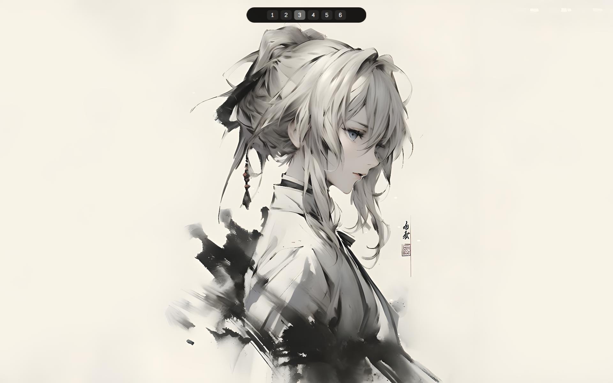
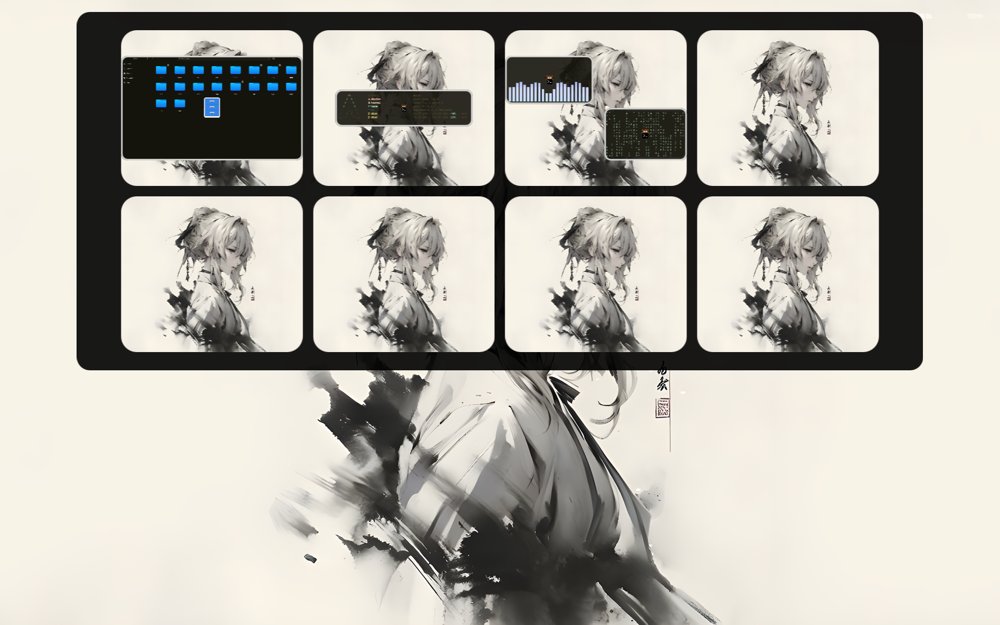
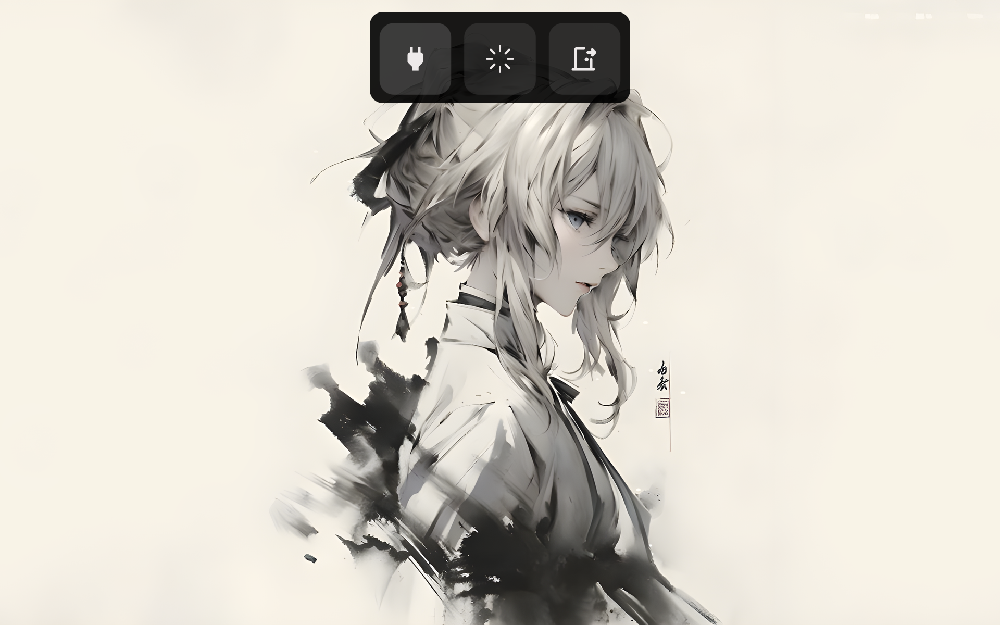
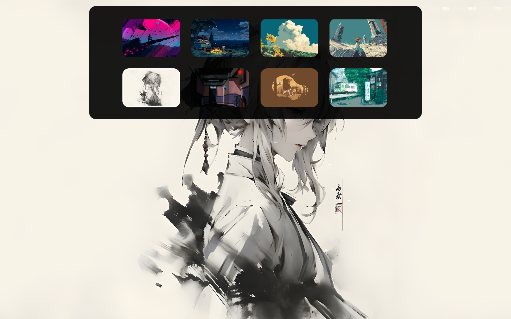
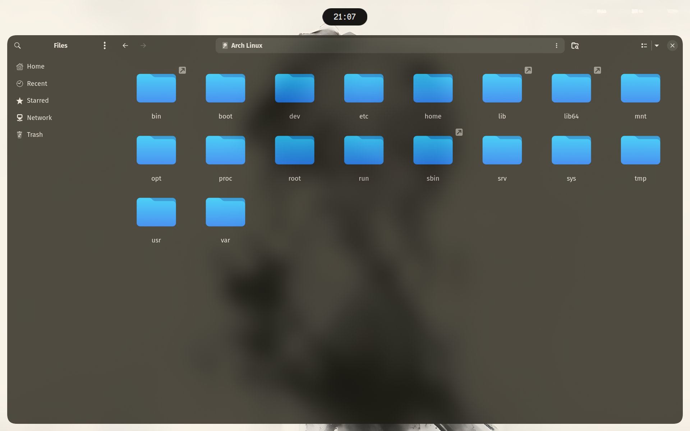
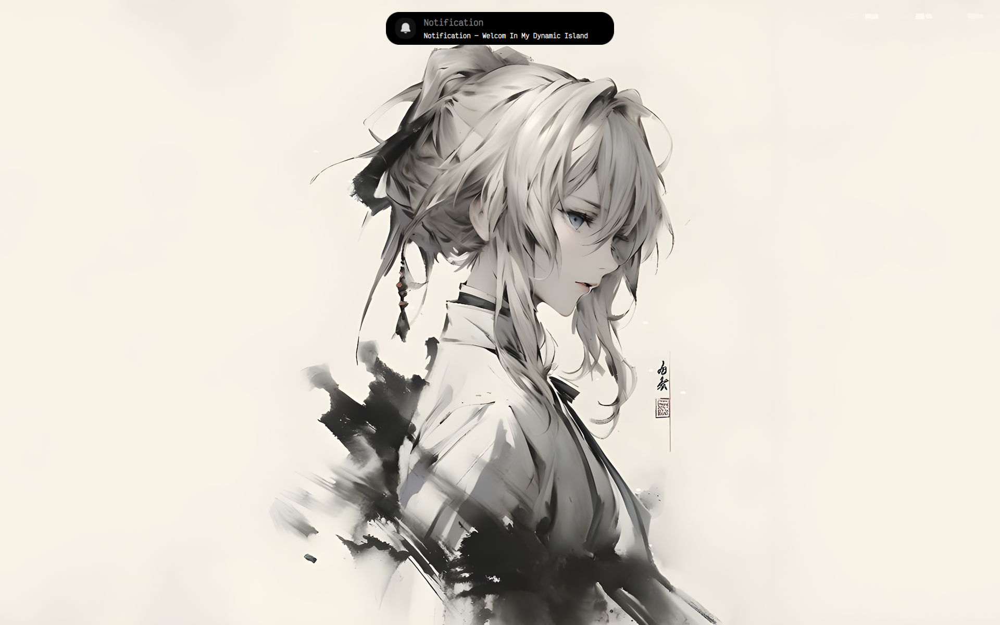
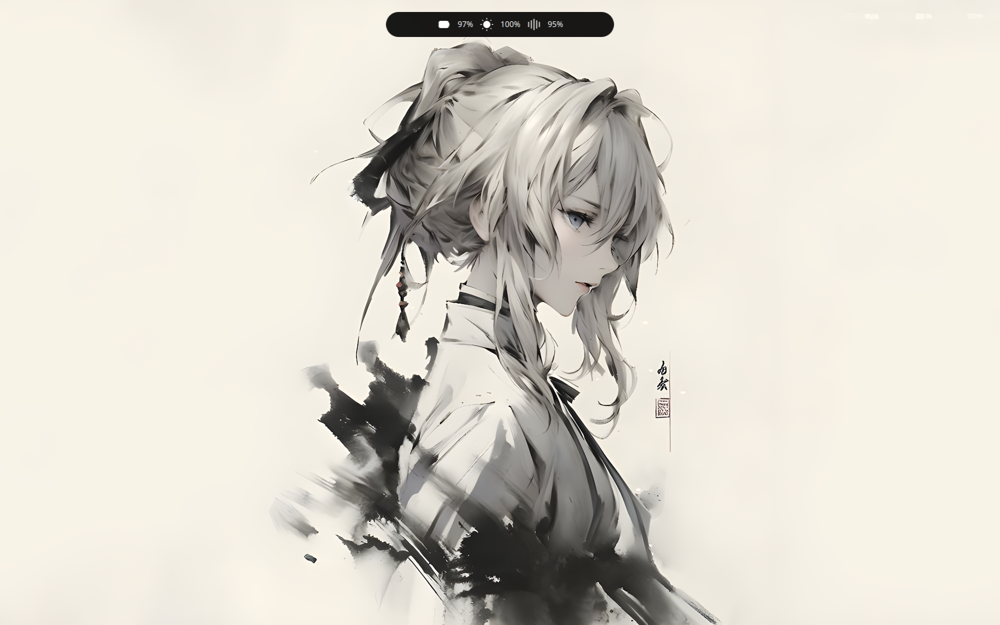
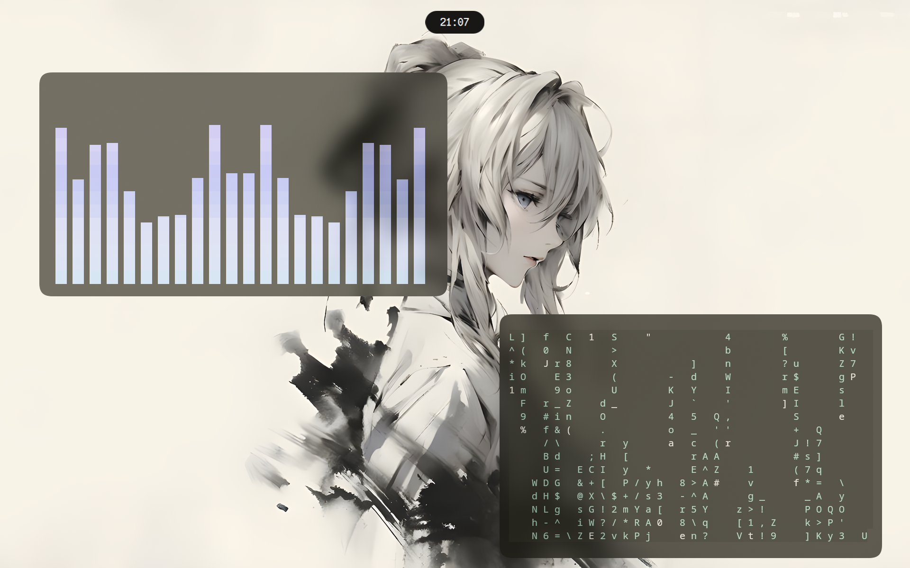

# Hyprland Dots

> A personal Hyprland environment built around my own workflow.

**Hyprland Dots** is a personal, independent Linux desktop environment built specifically for my own daily use.

This project is **not commercial**, not a distribution, and not intended to be a universal Hyprland configuration.

Everything here was built, configured, or integrated around the way I personally use my system.

The repository includes my Hyprland configuration, custom scripts, wallpapers, themes, applications, and **Bary** — a custom QuickShell-based UI that I built specifically for this environment.

> [!IMPORTANT]
> These dots were made for **me first**.
>
> They may contain assumptions about my hardware, software, workflow, and system configuration.
>
> The project is still evolving and may contain bugs or rough edges. It works as my personal environment, but it is not intended to be a polished commercial product.

---

# Preview

## Desktop


## Workspaces



## Workspace Overview



## Power Menu



## Wallpaper Selector



## File Manager



## Notifications



## Status / OSD



## Widgets



## Fastfetch


---

# Features

* Minimal, keyboard-driven Hyprland workflow
* **Bary** — custom QuickShell + QML desktop UI
* Custom bar / desktop interface
* Workspace Overview
* Power Menu
* Wallpaper Selector
* Notifications
* OSDs
* Dynamic theming with Matugen
* Automatic wallpaper color generation
* Personal wallpaper collection
* Custom Bash scripts
* Hyprlock screen locking
* Hypridle idle management
* SDDM with Astronaut Theme
* Kitty terminal
* Neovim development workflow
* Yazi and Nautilus integration
* Automatic installation script
* No Waybar
* No SwayNC
* No Wlogout
* No Rofi
* No Wofi
* No application launcher
* No settings dashboard
* No control center

---

# Bary

## More Than a Bar

**Bary** is the custom UI layer of this environment.

It is built with **QuickShell + QML** and was developed specifically for my own workflow.

Bary is not just a bar.

It is a collection of the UI components I actually wanted in my desktop environment:

* Bar / desktop UI
* Notifications
* OSDs
* Power Menu
* Wallpaper Selector
* Workspace Overview
* Workspace information
* Status indicators
* Custom widgets

Bary acts as the main UI layer of the environment, replacing several traditional Hyprland desktop utilities.

There is no need for:

* Waybar
* SwayNC
* Wlogout
* Hyprexpo

Bary handles the parts of the desktop that I personally need.

---

# What Bary Does NOT Have

Bary intentionally does **not** try to become a complete desktop environment.

There is:

* No Rofi
* No Wofi
* No application launcher
* No Settings application
* No Settings dashboard
* No Control Center
* No Dashboard
* No notification center
* No logout application

The idea is simple:

> **If I don't use it, I don't need to build it.**

This is a personal environment, so Bary is intentionally opinionated.

---

# Resource Usage

Bary currently uses approximately:

```text
~238 MB RAM
```

at idle in my environment.

Actual memory usage may vary depending on hardware, display configuration, running services, and system state.

Keeping the environment reasonably lightweight is important to me, but functionality and usability come first.

---

# Bary Components

## Power Menu

A custom power menu providing:

* Shutdown
* Reboot
* Logout

---

## Workspace Overview

Bary includes a built-in workspace overview for quickly viewing and navigating between workspaces.

It is bound to:

```text
Super + Tab
```

No external workspace overview application or plugin is required.

---

## Wallpaper Selector

A custom wallpaper selector integrated directly into Bary.

It works with:

* `awww`
* `matugen`

Changing the wallpaper automatically updates the generated desktop colors.

---

## Notifications

Bary provides its own notification UI.

No `swaync` is required.

---

## OSDs

Bary provides custom on-screen displays for system status changes such as:

* Volume
* Brightness

---

# Wallpapers

The repository includes a collection of wallpapers that I personally use and/or consider favorites.

The wallpapers are part of the project itself rather than being an external dependency.

The wallpaper workflow integrates with:

* `awww`
* `matugen`

The currently selected wallpaper is also saved locally so other parts of the environment can use it.

The current wallpaper backup is stored at:

```text
~/.config/quickshell/data/.wallpaper
```

---

# Wallpaper Script

The recommended way to change wallpapers is through Bary's wallpaper selector.

The underlying script is:

```text
~/.config/quickshell/scripts/set_wallpaper.sh
```

It handles the wallpaper workflow automatically:

1. Apply the wallpaper using `awww`
2. Generate colors using `matugen`
3. Update the desktop theme
4. Save a backup of the current wallpaper
5. Trigger the required desktop updates

No manual configuration editing is required.

---

# Applications

This environment is built around the applications I personally use.

| Application   | Purpose                |
| ------------- | ---------------------- |
| **Brave**     | Web browser            |
| **Kitty**     | Terminal               |
| **Neovim**    | Editor / Development   |
| **Yazi**      | Terminal file manager  |
| **Nautilus**  | Graphical file manager |
| **Fastfetch** | System information     |
| **Btop**      | System monitor         |
| **Cava**      | Audio visualizer       |

These applications are part of the workflow this configuration was designed around.

You can replace them with your own preferred applications if needed.

---

# Tools & Technologies

The environment makes use of:

* **Hyprland**
* **QuickShell**
* **QML**
* **awww**
* **Matugen**
* **Kitty**
* **Neovim**
* **Yazi**
* **Nautilus**
* **Hyprlock**
* **Hypridle**
* **PipeWire**
* **WirePlumber**
* **SDDM**

Bary itself is built with **QuickShell and QML**.

---

# Hyprlock

The setup uses **Hyprlock** as its screen locker.

Hyprlock is integrated directly into the Hyprland workflow and is configured as part of the installation.

It provides a native Wayland screen-locking experience that fits the rest of the environment.

---

# Hypridle

**Hypridle** is used for idle management.

It handles actions triggered after the system has been idle for a configured amount of time and works together with Hyprlock as part of the overall session workflow.

---

# SDDM

The login screen uses the **Astronaut SDDM Theme** by Keyitdev.

Repository:

https://github.com/Keyitdev/sddm-astronaut-theme

The installation script automatically installs and configures the theme as part of the setup.

The SDDM configuration is also integrated with the wallpaper workflow, allowing the login screen to use the current desktop wallpaper.

> [!NOTE]
> `sddm-astronaut-theme` is a third-party project.
>
> It is not part of Bary itself. The installer installs and configures it as part of the overall desktop environment.

---

# Keyboard Shortcuts

The main shortcuts are intentionally simple and centered around the applications and components I use most.

| Shortcut           | Action                       |
| ------------------ | ---------------------------- |
| **Super + B**      | Open Brave                   |
| **Super + N**      | Open Nautilus                |
| **Super + E**      | Open Yazi                    |
| **Super + Return** | Open Kitty                   |
| **Super + X**      | Open Bary Power Menu         |
| **Super + Tab**    | Open Bary Workspace Overview |
| **Super + K**      | Open Bary Wallpaper Selector |
| **Super + Q**      | Close Active Window          |

---

# Packages

The installation script automatically installs the packages required by the environment.

The exact package list may evolve as the project changes, but the main packages include:

<details>
<summary><b>Click to expand the package list</b></summary>

```text
# ==========================================
# Window Manager
# ==========================================

hyprland
hyprlock
hypridle


# ==========================================
# Bary / QuickShell
# ==========================================

quickshell
awww


# ==========================================
# Terminal / Editor
# ==========================================

kitty
zsh
neovim
yazi


# ==========================================
# File Manager
# ==========================================

nautilus


# ==========================================
# Theming
# ==========================================

matugen


# ==========================================
# Networking
# ==========================================

networkmanager
network-manager-applet


# ==========================================
# Audio
# ==========================================

pipewire
wireplumber
pavucontrol


# ==========================================
# Notifications / Desktop Integration
# ==========================================

libnotify
polkit-kde-agent

xdg-desktop-portal-hyprland
xdg-desktop-portal-gtk


# ==========================================
# Utilities
# ==========================================

brightnessctl
playerctl
pamixer

wl-clipboard

grim
slurp
swappy


# ==========================================
# Shell
# ==========================================

zsh-autosuggestions
zsh-syntax-highlighting


# ==========================================
# System Information / Monitoring
# ==========================================

fastfetch
btop
cava


# ==========================================
# General Utilities
# ==========================================

git
curl
wget
jq
zip
unzip


# ==========================================
# Build Tools
# ==========================================

base-devel
cmake
meson
ninja
pkgconf


# ==========================================
# Fonts
# ==========================================

noto-fonts
noto-fonts-emoji

ttf-victor-mono
ttf-iosevka-nerd

ttf-nerd-fonts-symbols-common
ttf-nerd-fonts-symbols-mono

otf-font-awesome


# ==========================================
# SDDM / Qt
# ==========================================

sddm

qt6-svg
qt6-declarative
qt6-multimedia
qt6-virtualkeyboard
qt5-quickcontrols2
```

</details>

---

# Installation

The installation process is designed to be as simple as possible.

```bash
git clone https://github.com/mazenmohamedshaker2009-coder/hyprland-dots

cd hyprland-dots

chmod +x install.sh

./install.sh
```

---

# Installation Script

The installer is designed to automate the setup of the entire environment.

Depending on the current system, it can:

* Install required packages
* Detect whether `yay` is installed
* Install `yay` if it is missing
* Ask for confirmation when necessary
* Copy configuration files
* Create required directories
* Create symbolic links
* Install Bary helper commands
* Configure Hyprland
* Configure QuickShell
* Configure wallpapers
* Install and configure the SDDM Astronaut Theme
* Configure Hyprlock
* Configure Hypridle
* Apply the required system configuration

After installation, the environment should be ready to use.

> [!WARNING]
> The installer modifies system and user configuration.
>
> **Read the installation scripts before running them**, especially if you are installing this on an existing Arch Linux system.

---

# Bary Commands

Some Bary functionality is exposed through command-line helpers.

Examples:

```bash
bary-power
bary-wallpapers
bary-workspaces
```

These commands provide convenient ways to trigger Bary components from terminals, scripts, or Hyprland keybindings.

---

# What Is Intentionally NOT Included

This setup intentionally does **not** include:

* Waybar
* SwayNC
* Wlogout
* Hyprexpo
* Rofi
* Wofi
* Application launchers
* Settings applications
* Settings dashboards
* Control centers
* Dashboard applications

Bary replaces the components I actually need, while the components I don't use simply don't exist.

There is no goal of filling the desktop with features just because they can be added.

---

# Philosophy

These dots are intentionally personal.

I am not trying to build the ultimate Hyprland rice.

I'm not trying to provide every possible widget, launcher, control panel, notification system, or customization option.

I built this because I wanted a desktop that behaves the way **I** want it to.

That means:

* Building custom components instead of installing another application
* Removing software I don't use
* Keeping the workflow keyboard-driven
* Integrating wallpapers and theming directly into the environment
* Keeping the UI focused
* Experimenting with technologies I enjoy
* Making the system feel coherent instead of assembling dozens of unrelated tools

Bary is a big part of that philosophy.

It isn't just a bar.

**It's the UI layer I wanted for my own desktop.**

---

# Project Status

This is an **active personal project**.

It works as my daily environment, but it is still evolving.

You may encounter:

* Bugs
* Hardware-specific configuration
* Missing edge cases
* Experimental components
* Configuration that assumes my own system
* Things that don't work on your machine

That is expected.

This repository represents my current setup rather than a finished, universal product.

---

# Disclaimer

**Hyprland Dots is a personal and independent project.**

It is not a commercial product.

It was created for my own use, experimentation, learning, and enjoyment.

You are welcome to explore the configuration, take inspiration from it, modify it, or use parts of it in your own setup.

Just keep in mind that it was designed around my own hardware, software, preferences, and workflow.

---

# Repository

https://github.com/mazenmohamedshaker2009-coder/hyprland-dots

---

Made with ❤️ and a questionable amount of time spent configuring Linux.

**— Mazen**

