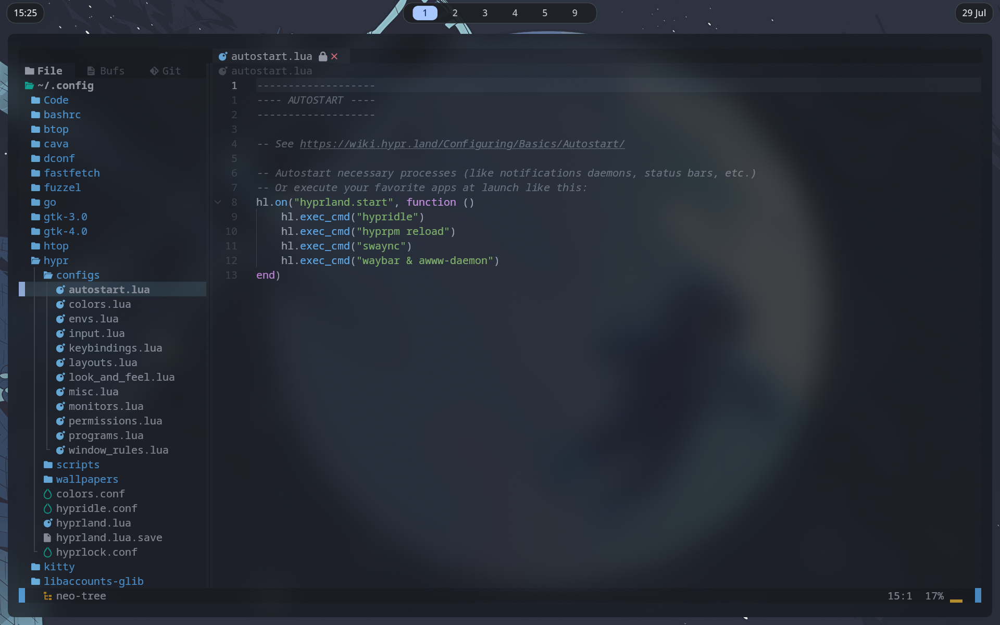
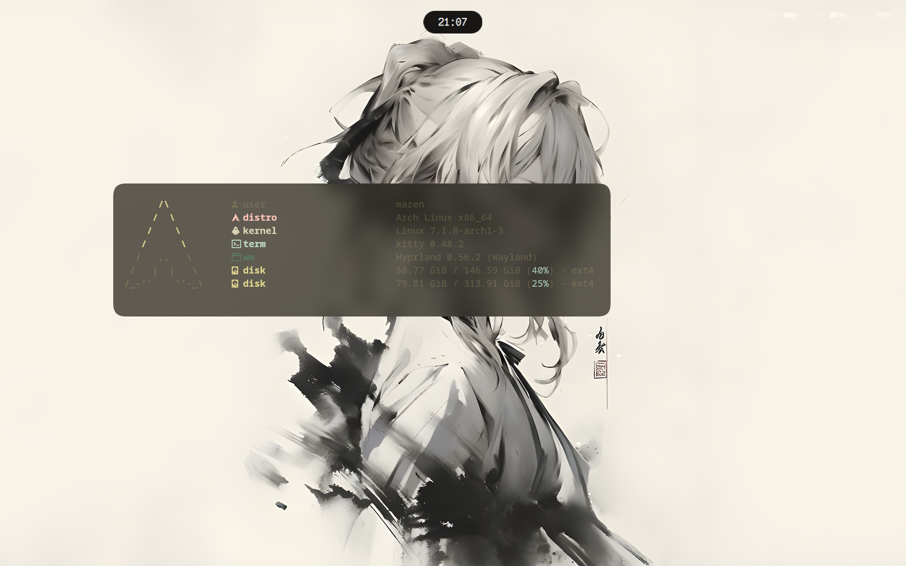
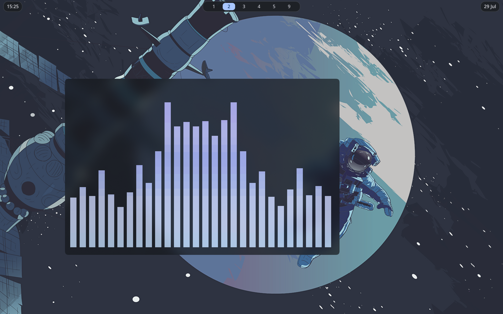
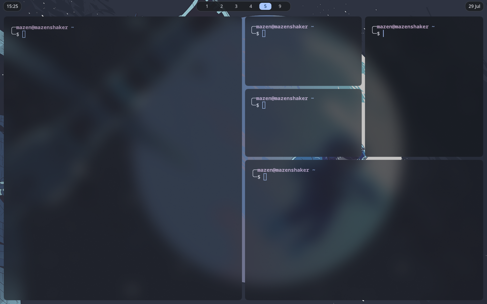
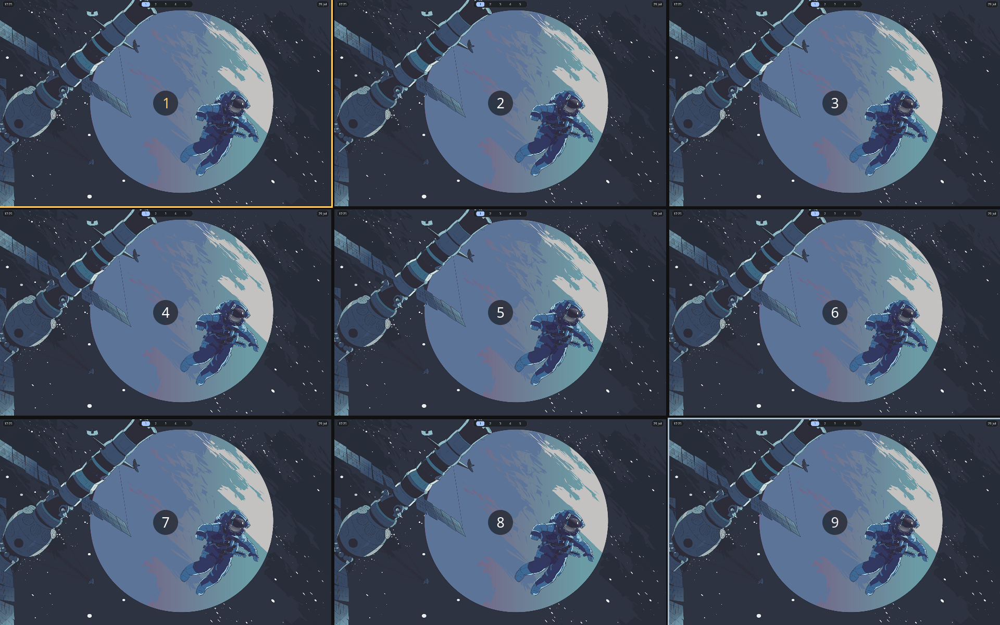

# Hyprland Dots

A minimal, keyboard-driven Hyprland setup built for speed, simplicity, and everyday use.

> [!IMPORTANT]
> These dotfiles are built around **my personal workflow**.
>
> They are **not** a commercial project, nor are they intended to satisfy everyone's preferences.
>
> Everything here exists because it fits **my workflow**. If you enjoy using them too, that's awesome—but keep in mind these dots were made for me first.

---

# Preview

## Desktop


## Neovim



## Fastfetch



## Cava



## Tiling



## Empty Workspace



## Wlogout


---

# Features

- Minimal keyboard-driven workflow
- Dynamic colors powered by Matugen
- Automatic wallpaper color generation
- Minimal Waybar
- Blur everywhere
- Custom Bash scripts
- Custom Wlogout
- Hyprlock
- Hypridle
- Built-in wallpaper manager
- Fast and lightweight
- Fully automatic installation

---

# Included Components

## SDDM Theme

This setup uses the excellent **Astronaut SDDM Theme**.

https://github.com/Keyitdev/sddm-astronaut-theme

---

## Workspace Preview

Workspace preview is powered by **Hyprexpo**.

https://github.com/sandwichfarm/hyprexpo

The installation script automatically:

- Adds the plugin repository.
- Installs the plugin.
- Enables it.

No manual configuration is required.

---

## Wallpapers

A wallpaper collection is included with the dotfiles.

Default location:

```text
~/.config/hypr/wallpapers/
```

Feel free to add your own wallpapers.

---

# Wallpaper Script

The recommended way to change the wallpaper is by using the built-in command.

```bash
wallpaper
```

After running the command, you'll be asked for the path to your wallpaper.

The script automatically:

- Applies the wallpaper.
- Regenerates Matugen colors.
- Updates the entire desktop theme.
- Reloads the required components.

There is no need to edit any configuration files manually.

---

# Keyboard Shortcuts

| Shortcut | Action |
|----------|--------|
| **Super + Return** | Open Kitty |
| **Super + E** | Open Yazi |
| **Super + N** | Open Nautilus |
| **Super + X** | Open Wlogout |
| **Super + Tab** | Workspace Preview |
| **Super + Q** | Close Active Window |

---

# Packages

The installation script automatically installs the following packages.

<details>
<summary><b>Click to expand the package list</b></summary>

```text
# ==========================================
# Hyprland
# ==========================================
hyprland
hyprlock
hypridle

# ==========================================
# UI
# ==========================================
waybar
wlogout
swaync

# ==========================================
# Terminal
# ==========================================
kitty
zsh
neovim
yazi

# ==========================================
# File Manager
# ==========================================
nautilus

# ==========================================
# Theming
# ==========================================
matugen

# ==========================================
# System
# ==========================================
networkmanager
network-manager-applet

pipewire
wireplumber
pavucontrol

libnotify

polkit-kde-agent

xdg-desktop-portal-hyprland
xdg-desktop-portal-gtk

# ==========================================
# Utilities
# ==========================================
brightnessctl
playerctl
pamixer

wl-clipboard

grim
slurp
swappy

swww

zsh-autosuggestions
zsh-syntax-highlighting

fastfetch
btop
cava

git
curl
wget
jq
zip
unzip

base-devel
cmake
meson
ninja
pkgconf

noto-fonts
noto-fonts-emoji

ttf-iosevka-nerd

ttf-nerd-fonts-symbols-common
ttf-nerd-fonts-symbols-mono

otf-font-awesome

sddm

qt6-svg
qt6-declarative
qt5-quickcontrols2
```

</details>

---

# Installation

```bash
git clone https://github.com/mazenmohamedshaker2009-coder/hyprland-dots

cd hyprland-dots

chmod +x install.sh

./install.sh
```

---

# Installation Script

The installer is **fully automatic**.

It will automatically:

- Install every required package.
- Detect whether `yay` is installed.
- Install `yay` if it is missing.
- Ask for confirmation whenever necessary.
- Clone all required repositories.
- Install and enable Hyprexpo.
- Copy all configuration files.
- Create symbolic links.
- Enable required system services.
- Apply all required configuration.

When the installation finishes, the desktop is ready to use.

---

# Default Browser

Firefox is configured as the default browser.

If you prefer another browser, simply edit the configuration after installation.

---

# What Is Not Included

These dotfiles intentionally **do not** include:

- Notification Control Center
- Waybar themes
- White theme
- System Tray
- Rofi
- Wofi
- Any application launcher

The Waybar intentionally contains only:

- Workspaces
- Date
- Clock

Nothing more.

This setup focuses on simplicity rather than adding every possible feature.

---

# Philosophy

These dotfiles are intentionally minimal.

They are built around my own workflow rather than trying to become a universal Hyprland configuration.

If you're looking for launchers, widgets, multiple Waybar themes, system trays, notification centers, and endless customization, these dots probably aren't for you.

If you're looking for a fast, clean, distraction-free and keyboard-driven Hyprland setup, you might enjoy them.

---

# Repository

```text
https://github.com/mazenmohamedshaker2009-coder/hyprland-dots
```

---

Made with ❤️ by Mazen
